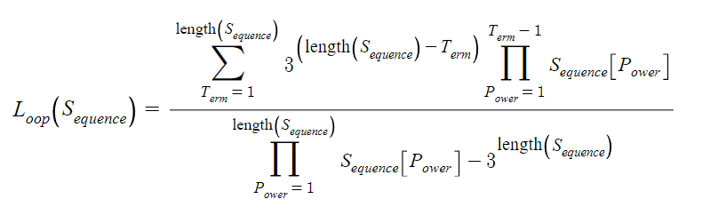
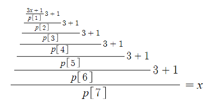
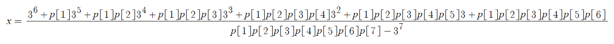

# Collatz Conjecture
A collection of scripts and tools for studying the Collatz Conjecture.

Start with some number `n`. If `n` is odd, multiply it by 3 and add 1. Conversely, if `n` is even, divide it by 2. Repeat this arbitrarily many times.

The Collatz Conjecture states that all natural numbers, when applying the above rule, will eventually reach 1.

A more general version of the Collatz Conjecture exists to account for 3 loops in the negatives, 0, and the positive loop containing 1.

## Collatz Loop Formula
A central part of the study is the Collatz loop formula. It takes a sequence of powers of 2, which represent the division steps of the Collatz sequence, and returns the value that will return to itself after said Collatz sequence.

Note, the above formula is designed with index-1 arrays in mind.

## Derivation of the Loop Formula
Start with some number `x`, then multiply it by 3 and add 1, then divide it by the first power of 2 in the sequence. This is the first iteration. Repeat this as many times as there are entries in the sequence, creating a nested fraction tower. Set it equal to `x` to make the sequence return to where it started.

This equation is linear, so there is exactly one solution for `x`. Solving for `x` reveals a pattern which is generalizable for sequences of arbitrary length.

Abstracting these patterns results in the Collatz loop formula.

## Applying to Rationals

Both the original definition of the Collatz sequence and the loop formula apply to rational values.

To apply the sequence, simply consider the numerator of the fraction when it is in its simplest form.

The loop formula will return rational values for most inputs.

## Known Attributes

- Given the linearity of the loop formula and its derivation, a given sequence will produce exactly one loop. All loops have a unique identity, and no two loops share the same steps.

- With the exception of 0 (which has no `3n+1` step), all possible loops can be produced by the formula. This includes -1/2, which has no division step, and is represented by a sequence containing only 1. A sequence is not permitted to contain 1 and non-1 values, as this will not produce a valid Collatz sequence (a 1 represents multiple consecutive `3n+1` steps, which is impossible except for numbers with an even denominator, which never divide by 2).

- If your starting value has a denominator divisible by 3, it will be quickly reduced until no factors of 3 remain due to the `3n+1` step. Thus, no loops exist with a denominator divisible by 3.

- If your starting value has an even denominator, the `3n+1` step will only ever produce another odd number, thus no divisions by 2 will occur. Save for -1/2, all starting values with even denominators will diverge.

- For simplicity's sake, numbers with denominators divisible by 2 or 3 are not considered canon, and are not considered in most cases.

- With the exception of numbers with denominators divisible by 3, applying an iteration of the Collatz sequence will never change the denominator of the number.

    - Because the fraction is simple, the numerator and denominator are coprime.
    - If `a` and `b` are coprime, then `a + b` is coprime to both `a` and `b`.
    - When applying the `3n+1` step, the denominator is not divisible by 3 by definition, so the multiplication by 3 preserves the sides being coprime. Adding 1 to a fraction is equivalent to adding the denominator to the numerator, i.e. `a + b`, which also preserves the sides being coprime.
    - When applying the division by 2 step, the numerator must be even, and thus contains a factor of 2. Dividing the number by 2 reduces the numerator, but preserves the denominator.
    - Therefore, all values within a Collatz loop share a denominator in their simplest form.

- The unsimplified numerator and denominator from the loop formula will be known as the "base numerator" and "base denominator" respectively.

    - Because the base denominator is computed only from the total powers of 2 and the length of the list, the distribution of factors of 2 within the sequence does not change the value. e.g. `[2,4,8]` and `[4,4,4]` both produce a base denominator of 37.
    - This means that odd numbers within the same loop (which translate the sequence left or right) share a base denominator. e.g. `[2,4,8]` and `[4,8,2]` are two values within the same 3-step loop.
    - Because they also share a simplified denominator, it means that every base numerator within a loop has the same greatest common divisor with the base denominator.