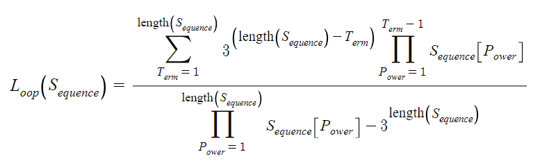
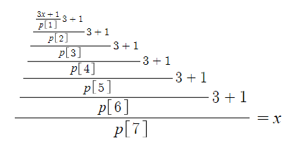
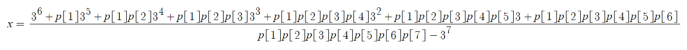

# Collatz Conjecture
A collection of scripts and tools for studying the Collatz Conjecture.

## Collatz Loop Formula
A central part of the study is the Collatz Loop Formula. It takes a sequence of powers of 2, which represent the division steps of the Collatz sequence, and returns the value that will return to itself after said Collatz sequence.

Note, the above formula is designed with index-1 arrays in mind.

## Derivation of the Loop Formula
Start with some number `x`, then multiply it by 3 and add 1, then divide it by the first power of 2 in the sequence. This is the first iteration. Repeat this for as many entries as there are in the sequence, creating a nested fraction tower. Set it equal to `x` to make the sequence return to where it started.

Solving for `x` reveals a pattern which is generalizable for sequences of arbitrary length.

Abstracting these patterns results in the Collatz Loop Formula.